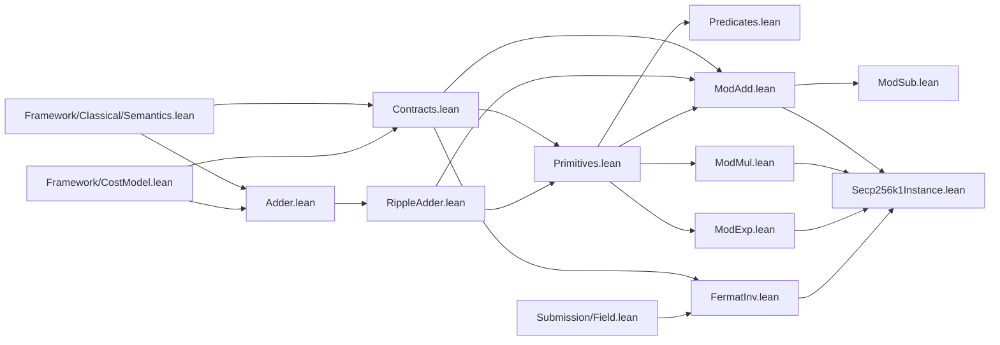
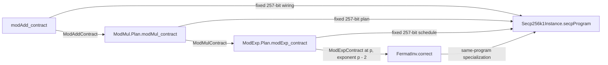

# Arithmetic

This directory contains the verified reversible field-arithmetic stack used by the
secp256k1 submission. Registers are lists of wire indices in least-significant-bit-first
order. The arithmetic circuits are deliberately textbook and generic in the modulus;
`Secp256k1Instance.lean` supplies their concrete 257-bit allocation at the field prime `p`.

Every composite operation is proved against the classical basis-state semantics and
packages correctness, locality, T-count, H/P-freedom, and gate well-formedness for the
same circuit term.

Each Lean file starts with a self-contained module header in the same order: the program in
syntax-sugared pseudocode, its public specification, and then the implementation and proof
details. Interface-only files explicitly say that they introduce no concrete circuit.

For a bottom-up explanation of the construction and proofs, see
[Verified Reversible Arithmetic for Shor ECDLP](../../../docs/ARITHMETIC.md).

## Import dependency DAG

The graph below shows direct project-local Lean imports. An arrow `A --> B` means that
`B` imports `A`. Mathlib imports and the root `ShorECDLP.lean` aggregator are omitted.



The mathematical construction has an additional contract-composition DAG. These arrows
are values and proofs supplied to plans, not Lean imports: higher layers do not import a
lower layer's private carry or workspace implementation.



## Files and public boundaries

| File | Role | Main public boundary |
| --- | --- | --- |
| [`Contracts.lean`](Contracts.lean) | Defines LSB-first public register layouts and the clean out-of-place interface shared by modular operations. | `RegisterLayout`, `CleanBinaryContract`, `ModAddContract`, `ModSubContract`, `ModMulContract`, `ModExpContract` |
| [`Adder.lean`](Adder.lean) | One-bit reversible full-adder cell over `CX` and `CCX`. | `fullAdder`, `fullAdder_sum`, `fullAdder_carry`, `fullAdder_tCount` |
| [`RippleAdder.lean`](RippleAdder.lean) | Chains full-adder cells into an n-bit ripple-carry adder. | `ripple`, `ripple_correct`, `ripple_tCount`, `ripple_HPFree`, `ripple_wellFormed` |
| [`Primitives.lean`](Primitives.lean) | Reusable implementation-neutral leaves: constant loading, controlled selection, register copying, support lemmas, and reverse-circuit cancellation. | `loadConst`, `selectPoint`, `copyReg`, `Arithmetic.run_reverse_cancel` |
| [`Predicates.lean`](Predicates.lean) | Bennett-clean reversible zero and equality flags over `X`, `CX`, and `CCX`. | `zeroFlag`, `zeroFlag_correct`, `equalFlag`, `equalFlag_correct` |
| [`ModAdd.lean`](ModAdd.lean) | Adds two registers modulo an arbitrary positive modulus using ripple addition, one conditional reduction, and uncomputation. | `modAdd`, `modAdd_contract` with exact cost `91 * width` |
| [`ModSub.lean`](ModSub.lean) | Subtracts two registers modulo an arbitrary positive modulus using two's-complement ripple subtraction, conditional correction, and uncomputation. | `modSub`, `modSub_contract` with exact cost `91 * width` |
| [`ModMul.lean`](ModMul.lean) | Bennett-clean schoolbook modular multiplication built from certified modular-addition calls. | `ModMul.Plan.program`, `ModMul.Plan.modMul_contract` |
| [`ModExp.lean`](ModExp.lean) | Bennett-clean, LSB-first square-and-multiply built from certified modular-multiplication calls. | `ModExp.Plan.program`, `ModExp.Plan.modExp_contract`, `ModExp.Plan.modExp_contract_uniform` |
| [`FermatInv.lean`](FermatInv.lean) | Thin field-specific correctness closure: exponentiation by `p - 2` computes inversion in `Fp`. It defines no second circuit. | `FermatInv.correct` |
| [`Secp256k1Instance.lean`](Secp256k1Instance.lean) | Concrete block allocation for the width-257 secp256k1 modular adder, multiplier, exponentiator, and Fermat inversion specialization. | `Secp256k1Instance.secpAddWiring`, `secpMulPlan`, `secpPlan`, `secp_modExp_contract`, `secp_fermat_inverse` |

## Contract discipline

`CleanBinaryContract program layout modulus op cost` binds all obligations to the exact
same `program`:

- `layout.lhs` and `layout.rhs` have equal width, are preserved, and contain canonical
  inputs below `modulus`;
- `layout.out` starts clean and receives `op lhs rhs mod modulus`;
- private `layout.work` wires start and finish clean;
- every control and target belongs to `layout.allWires` (`CircuitUsesOnly`);
- `tCount program = cost`;
- `program` is H/P-free and physically well-formed.

`ModMul.lean` and `ModExp.lean` use a Bennett compute-copy-uncompute wrapper: build the
forward history, copy the result to a disjoint public output, and run the history in
reverse. This restores all private work without exposing the lower-level implementation.

## Suggested reading order

1. [`Contracts.lean`](Contracts.lean) for the interface and invariants.
2. [`Adder.lean`](Adder.lean) and [`RippleAdder.lean`](RippleAdder.lean) for the bit-level
   arithmetic base.
3. [`Primitives.lean`](Primitives.lean) for the shared reversible-circuit tools.
4. [`Predicates.lean`](Predicates.lean) for clean reversible zero/equality flags.
5. [`ModAdd.lean`](ModAdd.lean), [`ModSub.lean`](ModSub.lean), [`ModMul.lean`](ModMul.lean), and
   [`ModExp.lean`](ModExp.lean) for the modular construction chain.
6. [`FermatInv.lean`](FermatInv.lean) for the generic secp256k1 field-inversion closure.
7. [`Secp256k1Instance.lean`](Secp256k1Instance.lean) for the concrete 257-bit plans, allocation,
   exact numeric costs, and same-program inversion specialization.

Run the complete repository proof gate from the repository root with:

```sh
./scripts/verify.sh
```
